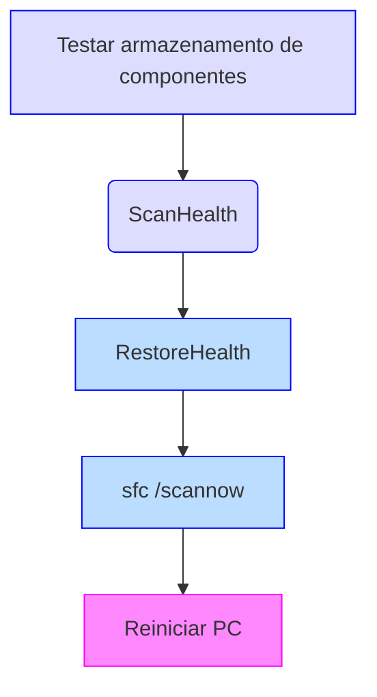

# Tutorial: Verificar e Reparar Arquivos de Sistema no Windows 11

> **Objetivo**
> Ensinar, passo a passo, como identificar e corrigir corrupção de arquivos do sistema operacional Windows 11 utilizando as ferramentas nativas **DISM** e **SFC**.

---

## Pré-requisitos

* **Conta com privilégios de administrador**
  Todos os comandos devem ser executados em Prompt de Comando ou PowerShell **executados como administrador**.
* **Conexão à Internet** (recomendado)
  Necessária para que o DISM baixe componentes íntegros do Windows Update.

  > Se estiver sem Internet, você precisará de uma **mídia ISO oficial** do mesmo build do Windows 11 instalado (veja a seção *Reparo offline*).

---

## Visão geral do fluxo



---

## Passo a passo detalhado

### 1. Abrir terminal elevado

1. Pressione <kbd>Win</kbd> e digite **cmd** (ou **PowerShell**).
2. Clique com o botão direito em **Prompt de Comando** → **Executar como administrador**.

### 2. Verificar rapidamente o estado do repositório de componentes

```powershell
DISM /Online /Cleanup-Image /CheckHealth
```

* Retorno “**No component store corruption detected**” → pule para o passo 4.
* Retorno “**The component store is repairable**” → prossiga para o próximo comando.

### 3. Análise minuciosa (varredura completa)

```powershell
DISM /Online /Cleanup-Image /ScanHealth
```

* Apenas detecta, **não** corrige. Pode levar de 5 a 15 min.

### 4. Reparar a imagem do sistema

```powershell
DISM /Online /Cleanup-Image /RestoreHealth
```

* Baixará componentes do Windows Update e substituirá arquivos corrompidos.
* Duração: 15–30 min (dependendo da velocidade da rede e SSD/HDD).

### 5. Verificar e corrigir arquivos de sistema

```powershell
sfc /scannow
```

* O **System File Checker** compara hashes e restaura arquivos inconsistentes.

### 6. Reiniciar

Reinicie o computador para garantir que todas as substituições sejam aplicadas.

---

## Reparo offline (sem Internet)

1. Baixe o ISO oficial do Windows 11 (mesma edição/build).
2. Monte o ISO (duplo clique) e anote a letra atribuída (ex.: `D:`).
3. Execute:

```powershell
DISM /Online /Cleanup-Image /RestoreHealth /Source:D:\Sources\install.esd /LimitAccess
```

> Substitua `D:` pela letra correta.

---

## Verificando integridade do disco (opcional)

Antes de rodar o DISM/SFC, assegure‑se de que o SSD/HDD não possui setores defeituosos:

```powershell
chkdsk C: /scan           # verifica online
chkdsk C: /perf /spotfix  # corrige — exige reinicialização
```

---

## Logs detalhados

* DISM: `%windir%\\Logs\\DISM\\dism.log`
* SFC: `%windir%\\Logs\\CBS\\CBS.log`

Abra com:

```powershell
notepad %windir%\Logs\CBS\CBS.log
```

---

## Possíveis erros e soluções rápidas

| Código/Descrição                                                                                 | Explicação                            | Ação recomendada                                                                                                              |
| ------------------------------------------------------------------------------------------------ | ------------------------------------- | ----------------------------------------------------------------------------------------------------------------------------- |
| **0x800f081f** “The source files could not be found”                                             | DISM não encontrou arquivos de origem | Verifique conexão à Internet ou aponte `/Source:` para ISO local                                                              |
| **0x800f0954**                                                                                   | WSUS bloqueia downloads               | Desconecte do domínio ou ajuste política de grupo `Specify settings for optional component installation and component repair` |
| SFC informa “Windows Resource Protection found corrupt files but was unable to fix some of them” | WinSxS também corrompido              | Execute a sequência completa DISM → SFC novamente ou faça *in‑place upgrade*                                                  |

---

## Referências oficiais

* Microsoft Docs – [Repair a Windows Image](https://learn.microsoft.com/windows-hardware/manufacture/desktop/repair-a-windows-image)
* Microsoft Support – [Use the System File Checker tool to repair missing or corrupted system files](https://support.microsoft.com/windows/use-the-system-file-checker-tool-to-repair-missing-or-corrupted-system-files-79aa86cb-ca52-166a-92a3-966e85d4094e)

---

> 💡 **FAQ breve**
>
> * **Posso interromper o `/RestoreHealth`?** Não, aguarde. Interromper pode deixar a imagem incoerente.
> * **Quanto tempo leva?** Em SSDs modernos com boa rede, todo o processo leva 20 – 40 min.
> * **Isso apaga meus arquivos?** Não; o procedimento atua somente nos arquivos de sistema.

---

*Fim do tutorial.*
